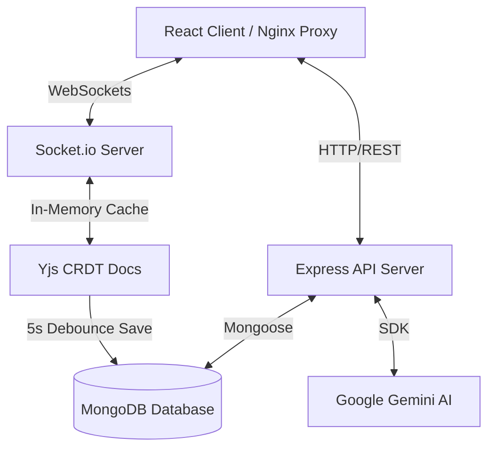

# Collaborative Workspace Platform

An enterprise-ready, collaborative editing workspace (similar to Notion) offering nested structures, rich-text styling, real-time Yjs CRDT synchronization, collaborative cursors, threaded comments, paginated notification alerts, historical versioning, and an integrated Google Gemini AI writing assistant.

---

## Technical Architecture

The platform is designed around a decoupled client-server architecture built for real-time collaboration and secure operations:



### Key Architectural Concepts
1.  **Conflict-Free Replicated Data Types (CRDT):** Powered by `Yjs` and mapped into ProseMirror nodes. Synchronization uses Socket.io to broadcast binary state vectors between editing clients.
2.  **Server Caching:** Document state is cached in-memory during editing sessions, with changes debounced (5 seconds after typing stops) to prevent database write fatigue.
3.  **Reverse Proxy Isolation:** For containerized local deployments, an Nginx container serves compiled static assets and proxies API (`/api/`) and Socket.io (`/socket.io/`) requests to the server container, bypassing CORS restrictions.

---

## Tech Stack

*   **Frontend:** React (Vite), Framer Motion, TipTap Editor, Socket.io-client, Lucide Icons, Yjs, y-prosemirror, y-protocols
*   **Backend:** Node.js, Express, MongoDB (Mongoose), Socket.io, Yjs, y-prosemirror, y-protocols, compression, express-rate-limit, helmet
*   **AI Integration:** Google Gemini Generative AI SDK (`@google/generative-ai`)
*   **Authentication:** JWT signed tokens delivered via secure HTTP-only cookies

---

## Core Features

### 1. Real-Time Collaboration & Sockets
*   Conflict-free real-time text edits using Yjs CRDT.
*   Collaborative cursor pointers with random assigned user colors, text labels, and highlighted selection decorators.
*   Socket presence rooms tracking active workspace and document viewers.

### 2. Comments & Mentions
*   Create, resolve, and reopen threaded comments.
*   Supports overlapping selection highlights (stores comma-separated comment IDs in editor marks).
*   Parse user mentions using `@FullName` tokens, pushing real-time Socket.io notifications.
*   Comment permissions locked down based on workspace roles (`allowViewerComments` option).

### 3. Version History & Timeline
*   Automatic snapshot creation inside socket auto-save timeouts (enforces a 10-minute cooldown and duplicate content prevention).
*   Manual snapshots with user descriptions.
*   **Atomic Version Restore:** Creates a backup version of the current state immediately before restoring a target version. Restored content is applied directly to the active Yjs `ydoc` instance, instantly updating all online collaborators' editors.
*   **Version Preview Mode:** Disconnects from Yjs and opens a read-only local editor to preview old version content.

### 4. Advanced AI Editing Experience
*   In-line Slash Commands (`/summarize`, `/rewrite`, `/continue`, `/translate`, `/brainstorm`).
*   Configurable text context (Selection, Current Paragraph, or Entire Document).
*   Operations history panel storing the last 10 AI outputs (supports insertions and undos).
*   AI request rate-limiting (sliding window of max 10 requests per minute).

---

## Folder Structure

```text
├── client/                     # Frontend Vite React App
│   ├── src/
│   │   ├── components/         # UI Panels, Versioning, Comments, Sidebar
│   │   ├── context/            # Auth, Toast, Socket, Theme Providers
│   │   ├── pages/              # Login, Signup, Dashboard, Workspace, Public pages
│   │   ├── services/           # Axios Client API instance
│   │   └── App.jsx             # Router configurations
│   ├── nginx.conf              # Nginx reverse proxy configuration
│   └── Dockerfile              # Client Dockerfile
│
├── server/                     # Backend API & Socket Server
│   ├── config/                 # Database Connection configurations
│   ├── controllers/            # Controller Handlers (Auth, Workspace, Comments, Versions)
│   ├── middleware/             # Rate limiters, Query sanitizers, Auth guards
│   ├── models/                 # Mongoose Schemas (User, Document, Comment, Activity)
│   ├── routes/                 # Express Router endpoint mappings
│   ├── services/               # Gemini AI SDK integrations
│   ├── socket.js               # Yjs synchronization socket rooms
│   └── Dockerfile              # Server Dockerfile
│
├── .github/workflows/          # CI Pipeline Configurations
│   └── ci.yml                  # GitHub Actions setup
├── docker-compose.yml          # Container orchestrator
├── .gitignore                  # Repository ignore configurations
├── package.json                # Monorepo monorepo workspace scripts
└── README.md                   # System documentation
```

---

## Environment Variables

The backend server requires the following variables defined in `server/.env` (based on `server/.env.example`):

| Variable Name | Description | Default Value | Required |
| :--- | :--- | :--- | :--- |
| `PORT` | Local server port | `5000` | No |
| `MONGODB_URI` | MongoDB connection string | `mongodb://127.0.0.1:27017/ai_workspace` | Yes |
| `JWT_SECRET` | Secret key signing authentication cookies | - | Yes |
| `NODE_ENV` | Running node environment (`development`/`production`) | `development` | No |
| `GEMINI_API_KEY` | Google Gemini API Key | - | Yes |
| `CLIENT_URL` | Frontend URL allowed for CORS requests | `http://localhost:5173` | Yes |

---

## API Overview

### 1. Authentication (`/api/auth`)
*   `POST /signup` - Register a new account.
*   `POST /login` - Login user and set HTTP-only cookie.
*   `POST /logout` - Clear user session cookie.
*   `GET /me` - Get current user profile.

### 2. Workspaces & Members (`/api/workspaces`)
*   `POST /` - Create a workspace.
*   `POST /:id/share` - Invite member by email (creates pending invitation).
*   `GET /:id/members` - Retrieve member list.
*   `PATCH /:id/member/:userId` - Update member roles (Viewer, Editor, Admin).
*   `DELETE /:id/member/:userId` - Remove member.

### 3. Documents & Versions (`/api/documents`)
*   `POST /` - Create a document.
*   `GET /:id` - Get document details.
*   `GET /:id/versions` - Retrieve paginated version history.
*   `POST /:id/versions` - Create manual snapshot.
*   `POST /:id/versions/:versionId/restore` - Restore a snapshot.
*   `GET /:id/activity` - Fetch workspace activity timeline.

---

## Installation & Setup

### Local Monorepo Run
1.  Clone the repository and install dependencies in the root:
    ```bash
    git clone <repository-url>
    cd ai-collaborative-workspace
    npm install
    npm install --prefix server
    npm install --prefix client
    ```
2.  Configure `server/.env` with your Mongo URI, JWT Secret, and Gemini API Key.
3.  Launch the services in development mode:
    ```bash
    # Runs backend server on http://localhost:5000 & Vite client on http://localhost:5173
    npm run server
    npm run client
    ```

### Running with Docker Compose
To run the entire hardened stack (Express Server, Mongo database, and Nginx proxy client) with a single command:
```bash
# Set GEMINI_API_KEY environment variable in your host environment, then run:
docker compose up --build
```
Open [http://localhost](http://localhost) in your browser. All API and WebSockets requests are automatically proxied via Nginx.

---

## Deployment Guide

### Database: MongoDB Atlas
1.  Create a free database cluster on [MongoDB Atlas](https://www.mongodb.com/cloud/atlas).
2.  In Network Access, allow access from anywhere (`0.0.0.0/0`) or whitelist your Render server IPs.
3.  Copy the connection string (replace username/password/database name) and save it for the backend environment variables.

### Backend: Render
1.  Create a **Web Service** on [Render](https://render.com) linked to your GitHub repository.
2.  Configure settings:
    *   **Root Directory:** `server`
    *   **Build Command:** `npm ci --only=production`
    *   **Start Command:** `node server.js`
3.  Define Environment Variables:
    *   `MONGODB_URI` = `mongodb+srv://...` (Atlas Connection String)
    *   `JWT_SECRET` = `your_strong_production_secret`
    *   `GEMINI_API_KEY` = `your_google_gemini_api_key`
    *   `NODE_ENV` = `production`
    *   `CLIENT_URL` = `https://your-client-domain.vercel.app`

### Frontend: Vercel
1.  Create a **Project** on [Vercel](https://vercel.com) linked to your GitHub repository.
2.  Configure settings:
    *   **Root Directory:** `client`
    *   **Framework Preset:** `Vite`
    *   **Build Command:** `npm run build`
    *   **Output Directory:** `dist`
3.  Define Environment Variables:
    *   `VITE_API_URL` = `https://your-backend-domain.onrender.com/api`

---

## License

This project is licensed under the MIT License.
